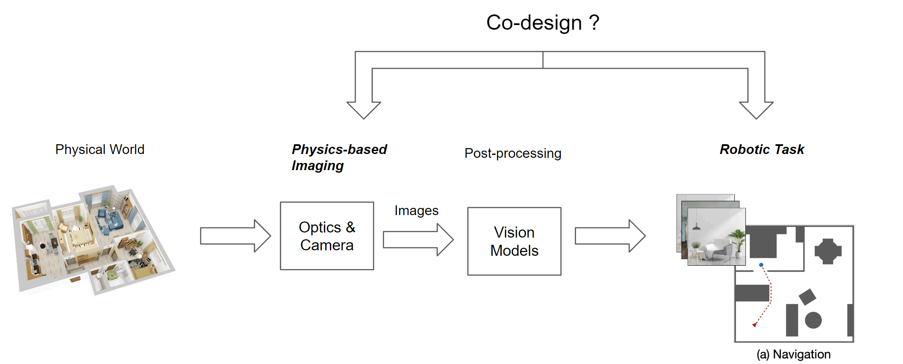
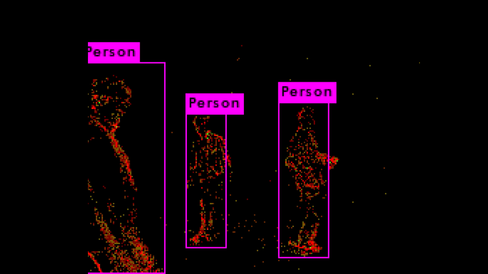

I am a **PhD student** in the **Computer Science** Department at the [University of Maryland, College Park](https://www.cs.umd.edu/). My research intereses is on the **intersection of vision and robotics**, with a focus on **Geometry and Motion based Vision** and **Physics-based Vision** for robots, also from my personal interest and if possible I prefer the problems and solutions that are **Bio-inspired**.  
 
 Besides working at the school, I did a summer internship as a **Robotics Software Engineer** at [Brain Corp](https://www.braincorp.com/), San Diego, CA, 
 worked on the projects related to the real-world mobile robotic applications deployed in Walmart and Sam's club. 
 
 Please see my [Pubications](https://codingrex.github.io/publications/) and [Projects](https://codingrex.github.io/projects/) pages for more details about my work. 

Here are some examples of problems in **Geometry and Motion based Vision** and **Physics-based Vision** that I am trying to solve in my PhD.

### 1. Physics-based Vision:
A problem can be categorized into **Computational Images + Robotics** . Can we find a better eye design for mobile robot such that it can
improve the performance for a specific robotic task (like Navigation).

Note that this problem is more **fundamental** than just optimizing the **post-processing** neural network which act on the images like in most vision problems.
I want to do it before the image is formed from the physical world (improving the Imaging step), which is before the post-processing
 step for the fundamental performance improvement to the vision model (and thus the down-stream robotic task) in its input not during the post-processing.

### 2. Geometry and Motion based Vision:
The bio-inspired Neuromorphic camera, Event Camera, provides us a new way of vision that only record the motion information (events) and with low-latency (high time resolution) and high dynamic range feature. 
This is an example of using this motion information from event camera to do the vision tasks like human detection  

