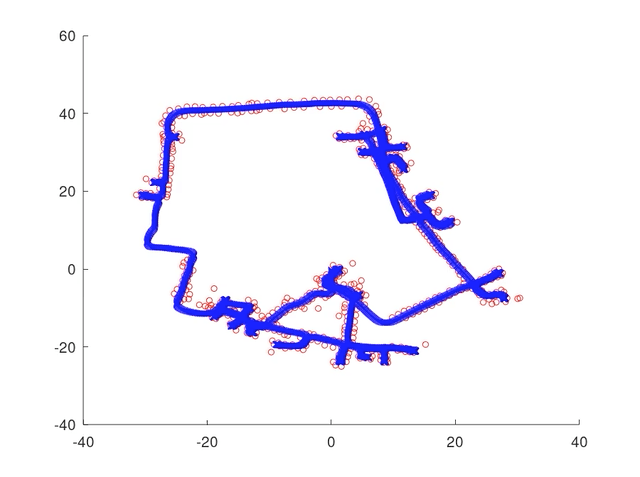

- ## [Long-term Autonomy of Mobile Robots](https://github.com/codingrex/Long-Term-Autonomy)
    My Research Assistant project for exploring and solving some real-world mobile robotics problems (in Perception, SLAM, Planning).
    
    I started with building up and testing the navigation stack (Perception, SLAM, Motion Planning) on a mobile robot research platform. (based on TurtleBot 2). 
     
    
    

- ## [Fundamental SLAM Algorithms](https://github.com/codingrex/SLAM_Course)
    I learned and implemented some fundamental SLAM algorithms based on the Robot Mapping lecture series from Dr. Cyrill Stachniss.
    
    After doing self-learning on the videos and lecture notes, I learned the basics of what is SLAM, how to do (classic paradigms) and why (Derivation). 
    
    The topics including: 
    * Odomotery model and Sensor model
    * Kalman filter family: EFK, UKF 
    * (Rao-Blackwellized) Particle filter 
    * Feature-based mapping and Occupancy grid based mapping 
    * FastSLAM
    * Graph-based SLAM (front-end, back-end)
    
    
    
    

- ## [Persistent-Monitoring using Multi-Robot (UAV-UGV) Coordination](https://github.com/VishnuDuttSharma/CMSC818B_MiniProject_2/tree/main/python#persistent-monitoring-using-multi-robot-uav-ugv-coordination)
    *Course project for* ***Decision-Making for Robots (CMSC818B)*** *course at UMD, College Park (Fall 2020)*
    
     Persistent Monitoring in robotics is the problem of monitoring an area in repeated manner. This is useful for applications like monitoring forest fires, where we need to visit the repeatedly to look for signs of fire. This can be done using a team of Unmanned Ground Robots (UGVs). They can avoid overlaps if they know each other's locations. In a case where the communication range is limited, a UAV can be used to communicate such information by patrolling the area independently and sharing the information (or belief) about locations with UGVs.
     
     In this project we propose heuristic-based and RL-based strategy to move the UAV to increase the certainty about the location of the UGVs.
     
    